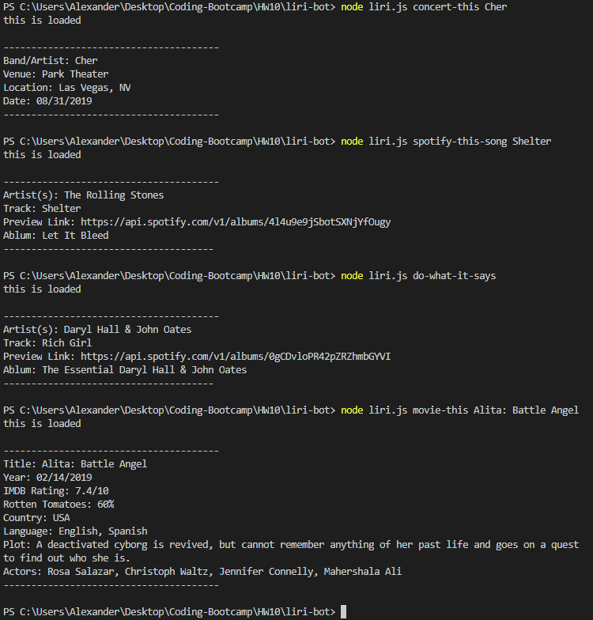

# liri-bot
Node app used to search for band concerts, songs on spotify, movies from imdb, or run a search from a text file.

##REQUIRED NODE PACKAGES:
*node-spotify-api
*axios
*moment
*fs
*dotnv with a .env file with the content:
Spotify API keys

SPOTIFY_ID=[YOUR SPOTIFY ID]
SPOTIFY_SECRET=[YOUR SPOTIFY SECRET]

##TO RUN:
Type "node liri.js [search command] [movie/band/song name]"
without brackets or quotations

##Search Commands

###Command:
"concert-this"

Returns:
Name of the venue
Venue location
Date of the Event (use moment to format this as "MM/DD/YYYY")

###Command:
"spotify-this-song"

Returns:
Artist(s)
The song's name
A preview link of the song from Spotify
The album that the song is from

###Command:
"movie-this"

Returns:
Title of the movie
Year the movie came out
IMDB Rating of the movie
Rotten Tomatoes Rating of the movie
Country where the movie was produced
Language of the movie
Plot of the movie
Actors in the movie

###Command:
"do-what-it-says"
Runs search from text from random.txt.
Write out your search command and song name in the random.txt file
Format:
[search command], "[movie/band/song name]"
Example:
spotify-this-song, "Rich Girl"

###Example of App usage:

